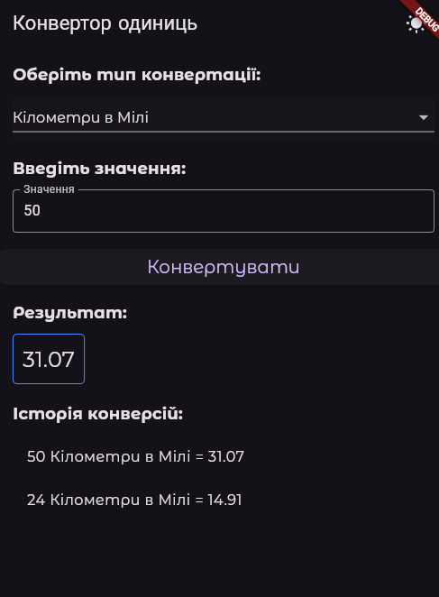

<div align="center">

# Unit Metrics Converter 🔄

[](https://github.com/RichardLitt/standard-readme)
[](https://flutter.dev/)
[](https://dart.dev/)

🌍 [🇺🇦 Українською](#укр) | [🇬🇧 English](#eng)

> Сучасний мобільний додаток на Flutter з чистою архітектурою для швидкої конвертації одиниць. 
> <br> A modern, clean-architecture mobile application built with Flutter for fast unit conversions.

<br>


</div>

---

<a name="укр"></a>
## 🇺🇦 Українська версія

Цей проєкт надає зручний і привабливий інтерфейс для миттєвої конвертації різних метрик (довжина, площа, вага, об'єм), зберігаючи історію конвертацій локально на вашому пристрої.

### 📋 Зміст (Table of Contents)
- [Передумови (Background)](#передумови-background)
- [Встановлення (Install)](#встановлення-install)
- [Використання (Usage)](#використання-usage)
- [Розробники (Maintainers)](#розробники-maintainers)
- [Внесок (Contributing)](#внесок-contributing)
- [Ліцензія (License)](#ліцензія-license)

### 💡 Передумови (Background)
Цей додаток було створено для демонстрації **Чистої Архітектури (Clean Architecture)** у Flutter. Він суворо розділяє відповідальність на:
- 📦 **Моделі (Models)**
- ⚙️ **Сервіси бізнес-логіки (Services)**
- 🎨 **Шар інтерфейсу (UI)**

Додаток підтримує динамічну зміну тем (Світла/Темна), плавні анімації та використовує `shared_preferences` для локального збереження історії. Таким чином, бізнес логіка повністю відділена від екранів користувача.

### 🛠 Встановлення (Install)
Для запуску на вашому комп'ютері має бути встановлений [Flutter](https://flutter.dev/docs/get-started/install).

1. Клонуйте репозиторій:
   ```bash
   git clone https://github.com/Lutvunenko-Dmutro/metrics_converter_flutter.git
   ```
2. Перейдіть до папки проєкту:
   ```bash
   cd metrics_converter_flutter/metrics_converter_flutter
   ```
3. Завантажте залежності:
   ```bash
   flutter pub get
   ```

### 🚀 Використання (Usage)
Запустіть додаток на підключеному пристрої або емуляторі:
```bash
flutter run
```
**Основні функції:**
- Розрахунок різноманітних метрик (США/Британські в Метричні тощо).
- Збереження та перегляд минулих конвертацій.
- Миттєва зміна тем.

### 👥 Розробники (Maintainers)
[@Lutvunenko-Dmutro](https://github.com/Lutvunenko-Dmutro)

### 📄 Ліцензія (License)
[MIT](LICENSE) © Dmutro Lutvunenko

---

<a name="eng"></a>
## 🇬🇧 English Version

This project provides a robust and visually appealing interface to convert various metrics (length, area, weight, volume) instantly, storing the conversion history locally.

### 📋 Table of Contents
- [Background](#background)
- [Install](#install)
- [Usage](#usage)
- [Maintainers](#maintainers)
- [Contributing](#contributing)
- [License](#license)

### 💡 Background
This application was created to demonstrate a **Clean Architecture** pattern in Flutter. It strictly separates concerns into:
- 📦 **Models**
- ⚙️ **Business Logic Services**
- 🎨 **UI Presentation Layer**

It supports dynamic theming (Light and Dark modes) and utilizes smooth animations to provide a premium user experience. All conversion history is persistently stored locally using `shared_preferences`.

### 🛠 Install
To get this project running on your local machine, you need to have [Flutter](https://flutter.dev/docs/get-started/install) installed.

1. Clone this repository:
   ```bash
   git clone https://github.com/Lutvunenko-Dmutro/metrics_converter_flutter.git
   ```
2. Navigate into the project directory:
   ```bash
   cd metrics_converter_flutter/metrics_converter_flutter
   ```
3. Install dependencies:
   ```bash
   flutter pub get
   ```

### 🚀 Usage
To start the application on a connected device or emulator, run:
```bash
flutter run
```
**Key Features:**
- Convert readily between various standard units.
- Conversion history is saved locally and remains available across restarts.
- Seamlessly switch between dark and light themes directly from the app bar.

### 👥 Maintainers
[@Lutvunenko-Dmutro](https://github.com/Lutvunenko-Dmutro)

### 📄 License
[MIT](LICENSE) © Dmutro Lutvunenko
